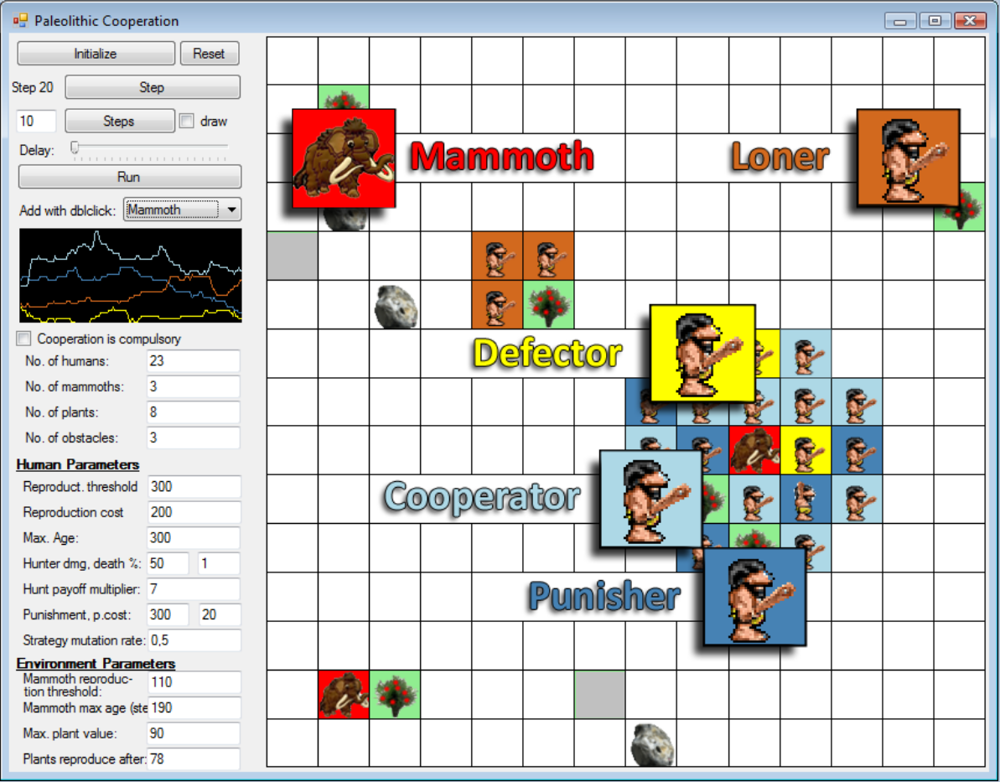

A Two-Dimensional Simulation of Cooperation in Palaeolithic Societies
===============

**[Poster containing summary and results](cooperation_poster_Madl_T.pdf)**

An agent-based social simulation of a Palaeolithic human society, where cooperation is necessary for successful hunting. The model is intended to investigate the question of how cooperative behaviour can emerge and prevail, despite cooperative behaviours potentially having high individual cost.

The agents act in a two-dimensional environment containing human agents, hunting prey, plants for foraging, and landscape possibly obstructing line of sight (which results in the agents receiving incomplete information, unlike in most existing models of the evolution of cooperation). Individual humans follow one of four strategies – they can be cooperators, helping during a hunt and receiving large rewards; defectors, taking from the hunt’s rewards but not cooperating; punishers, cooperating and punishing defectors; or loners, abstaining from the hunt and surviving by foraging. Initially, the strategies are assigned randomly with equal probabilities, but they can change after each step, either through mutation or through learning about better strategies. The Darwinian fitness the agents can achieve largely depends on their chosen strategy. 

Agents have basic cognitive capabilities, which are equipped with simple finite state machine based control architectures. Their chosen actions depend on their current state, as well as their chosen strategy. Agents can get injured (implemented as subtracted payoff) or even die if they actively participate in a hunt (cooperators and punishers). Agents can also die if they are denied food from foraging or hunting long enough; or, eventually, they can die due to natural causes. However, they also have the ability to reproduce – provided their payoff (which corresponds to Darwinian fitness) is high enough – which results in children having the same strategies as their parents.

Agent strategies can permanently change after every step of the simulation, in two ways. On the one hand, there is a low probability for random mutation, which accounts for experimenting behaviour. On the other hand, agents can observe other agents and adopt foreign strategies if they perceive them to be more successful – to yield higher payoffs – than their own. The individual agent fitness, and thus the chance of reproduction and of death, depends on the achieved payoff (gained either by hunting or by foraging). 

